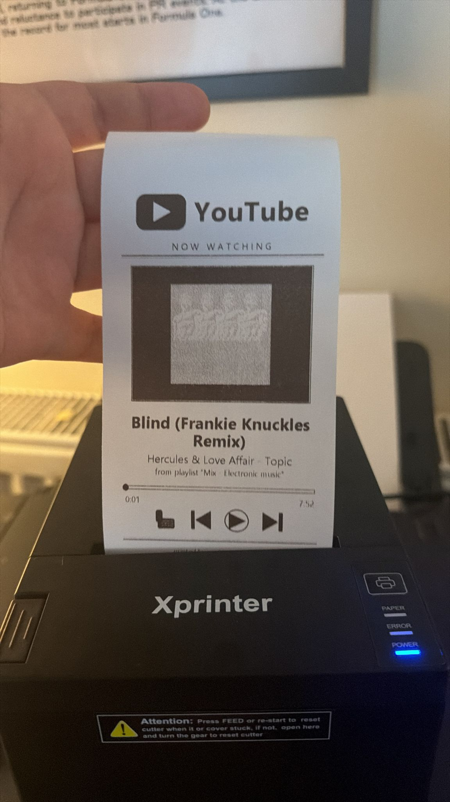

# yt-thermal-printer

Prints a YouTube "now watching" receipt to an XP-80 thermal printer every time the
playing video changes inside a playlist.



## How it works

```
   ┌────────────────────────────┐        POST /print          ┌───────────────────────┐
   │  Chrome / Edge extension   │   ───────────────────────▶  │  yt_printer.py        │
   │  (content script in       │   { title, channel,         │  local HTTP server    │
   │   youtube.com tab)         │     playlist, elapsed,      │  127.0.0.1:7878       │
   └────────────────────────────┘     duration, thumbnail }   └──────────┬────────────┘
                                                                          │ ESC/POS raster
                                                                          ▼
                                                                ┌───────────────────┐
                                                                │  XP-80 (USB)      │
                                                                │  Windows spooler  │
                                                                │  driver: Generic  │
                                                                │  / Text Only      │
                                                                └───────────────────┘
```

* The **content script** watches `youtube.com/watch?v=…&list=…` pages. When the
  `v=` parameter changes, it waits ~1.5 s for metadata to settle, then POSTs the
  current track to the local server.
* The **server** is a tiny `http.server`-based Python app. It downloads the
  video thumbnail, renders a 576-pixel-wide receipt image with PIL (YouTube
  logo, title, channel, playlist, progress bar, playback controls), packs the
  bitmap into an ESC/POS `GS v 0` raster command, and writes it to the
  `XP80` Windows print queue via the Win32 spooler API (`win32print`).
* No Xprinter driver is required — the printer is bound to Windows'
  built-in **Generic / Text Only** driver on port `USB002`. That driver
  passes raw bytes straight through to the device.

## Requirements

* Windows (the server uses `win32print`)
* Python 3.10+
* An Xprinter XP-80 (or any ESC/POS-compatible 80 mm thermal printer)
  visible to Windows on a USB port
* Chrome, Edge, or another Chromium-based browser

## One-time setup

### 1. Bind the printer to a Windows print queue

If `Get-Printer` doesn't show your XP-80, run this in PowerShell as
administrator (replace `USB002` with whichever port your device enumerated on):

```powershell
Add-PrinterDriver -Name "Generic / Text Only"
Add-Printer      -Name "XP80" -DriverName "Generic / Text Only" -PortName "USB002"
```

You can find the right port in Device Manager → the "Printer POS-80" entry →
Properties → Details → "Bus relations" (or just look for `USB00n` in the
PowerShell output of `Get-PnpDevice -Class USBPrint`).

### 2. Install Python dependencies

```cmd
pip install pywin32 Pillow
```

### 3. Load the browser extension

1. Open `chrome://extensions`
2. Enable **Developer mode** (top-right)
3. **Load unpacked** → pick the `yt_extension/` folder
4. (Optional) Pin the extension; click its icon for endpoint settings, a
   "Ping server" button, and a "Test print" button.

The first time the content script POSTs to `127.0.0.1`, Chrome will pop up a
**Private Network Access** prompt — accept it. After that the request goes
through silently.

## Running

```cmd
:: terminal stays open while serving — close it to stop
start_server.bat
```

…or run it manually:

```cmd
python yt_printer.py --serve
```

Then play a video inside a playlist on YouTube. Every time the track changes,
a receipt comes out of the printer.

## CLI options

`yt_printer.py` is dual-purpose: it can run as a server, print a one-off mock
receipt, or save a PNG preview for layout iteration without burning paper.

| Flag             | What it does                                          |
| ---------------- | ----------------------------------------------------- |
| `--serve`        | Start the HTTP print server (default port 7878)       |
| `--host`         | Bind host (default `127.0.0.1`)                       |
| `--port`         | Bind port (default `7878`)                            |
| `--printer`      | Windows print queue name (default `XP80`)             |
| `--preview`      | Save `preview_yt.png` instead of printing             |
| `--title` etc.   | Override mock-data fields when printing one-off       |

Example — preview a layout without printing:

```cmd
python yt_printer.py --preview --title "Some Track" --channel "Some Channel"
```

## HTTP API

`POST /print` accepts JSON:

```json
{
  "title":     "Video title",
  "channel":   "Channel name",
  "playlist":  "Playlist name",
  "elapsed":   "0:42",
  "duration":  "3:33",
  "thumbnail": "https://i.ytimg.com/vi/<id>/hqdefault.jpg"
}
```

All fields are optional except `title`. `elapsed` / `duration` use `m:ss`
format. `GET /health` returns a small JSON OK for liveness checks.

## Extension settings

Click the extension's toolbar icon to:

* toggle the printer on/off,
* change the server endpoint (e.g. another machine on the LAN),
* manually fire a "Test print" with mock data,
* "Ping" the server for a quick liveness check.

By default the content script only prints when the URL contains a `list=`
parameter (so single-video pages won't spam the printer). To print on every
video, change `REQUIRE_PLAYLIST` to `false` in `yt_extension/content.js`.

## Files

```
yt-thermal-printer/
├─ yt_printer.py           server + ESC/POS raster generator
├─ start_server.bat        one-click server launcher (Windows)
├─ yt_extension/
│  ├─ manifest.json        MV3 manifest
│  ├─ content.js           DOM watcher + POST to /print
│  ├─ popup.html           settings UI
│  └─ popup.js
└─ .gitignore
```

## Notes / limitations

* The thumbnail is dithered to 1-bit with Floyd-Steinberg. High-contrast
  images print clearly; busy thumbnails turn into a haze.
* The print head and cutter have a physical offset; the server feeds 6
  line-feeds after the image before cutting so nothing gets sliced through.
  If your model's cutter is further away, increase `BOTTOM_PAD` in
  `yt_printer.py`.
* The XP-80's printable width is 576 px (72 mm at 8 dots/mm). Don't change
  `WIDTH` unless you have a different printer.
* The extension targets the current YouTube watch-page DOM. YouTube changes
  selectors occasionally; if titles or channel names stop showing up, update
  the selector lists in `gather()` inside `content.js`.

## License

MIT.
